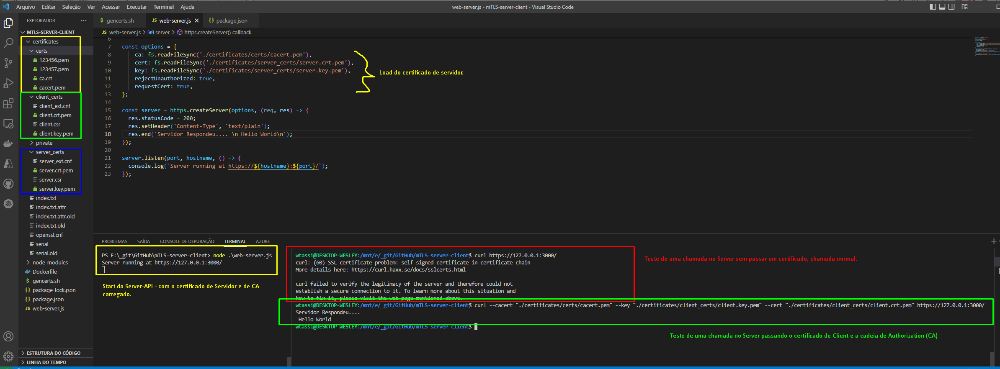

# Server-Client-mTLS

A ideia deste repositório, é tentar, digo, TENTAR, diminuir tal complexidade na emissão de certificados e configuração dos mesmos assim como testar uma chamada a uma API passando os certificados necessários.

>OBS: no arquivo `gencerts.sh` possui valores DEFAULT, que tem de a servir como **EXEMPLO** para vocês. Além de explicações sobre cada propriedade (mais importantes) do `openssl`.

Para Rodar o Script BASH, recomendo executar de um terminal Linux.
Eu utilizo SO Windows, possuo o Docker-Desktop instalado, e consequentemente uma instancia WSL do Ubuntu, então quando abro o VSCODE (minha IDE de atuação), eu **Abro um terminal (CTRL+J), vou no cantinho inferior direito, clico no na setinha pra baixo ao lado de + e escolho a opção "Ubuntu (WSL)" e ZAZZZZ.... terminal Linux dentro do Windows... e tudo é lindo.
Para execução do Projeto em Node.js, executo no querido Powershell (integrado e default do VSCODE).

## > Install & Dependence
### **Windows**
| Software   | Download |
| ---       | ---      |
| Node | [download](https://nodejs.org/dist/v16.15.1/node-v16.15.1-x64.msi) |
| Docker-Desktop | [download](https://nodejs.org/dist/v16.15.1/node-v16.15.1-linux-x64.tar.xz) |

### **Linux**
| Software   | Download |
| ---       | ---      |
| Node | [download](https://nodejs.org/dist/v16.15.1/node-v16.15.1-linux-x64.tar.xz) |
| Docker-Desktop | [download](https://docs.docker.com/desktop/linux/install/) |

## Execução:

1. Abra o arquivo `gencerts.sh` presente na raiz deste projeto, e da linha **12** até a linha **25** são valores possíveis de alterações sem que haja problemas... dali para baixo, recomendo não mexer se não for a fim de aprendizado, alterações, curiosidades e etc... que é o intuito de fornecimento deste código.

2. Abra o terminal Linux e execute o comando que irá criar todos os certificados.
```bash
mTLS-server-client$   ./gencerts.sh
```

3. Executando server (in Node.js):
```powershell
PS E:\_git\mTLS-server-client>   npm install
PS E:\_git\mTLS-server-client>   node .\web-server.js 

# Irá aparecer uma saída como esta:
Server running at https://127.0.0.1:3000/
```

4. Executando uma chamada na API (via terminal LINUX com o uso do CURL) - SEM CERTIFICADO
```bash
mTLS-server-client$   curl https://127.0.0.1:3000/

# Uma saída como esta abaixo deverá acontecer....
curl: (60) SSL certificate problem: self signed certificate in certificate chain
More details here: https://curl.haxx.se/docs/sslcerts.html

curl failed to verify the legitimacy of the server and therefore could not
establish a secure connection to it. To learn more about this situation and
how to fix it, please visit the web page mentioned above.

# Significa que a aplicação espera por um Certificado válido com base na combinação de Server-CERT e CA-CERT configurado após Handshake TLS com o Servidor.
```

5. Executando uma chamada na API (via terminal LINUX com o uso do CURL) - COM CERTIFICADO DE CLIENTE
```bash
mTLS-server-client$   curl --cacert "./certificates/certs/cacert.pem" \
  --key "./certificates/client_certs/client.key.pem" \
  --cert "./certificates/client_certs/client.crt.pem" \
  https://127.0.0.1:3000

# E uma saída como esta abaixo deverá aparecer:
Servidor Respondeu....
  Hello World  :D

# Significa que o cliente conseguiu acessar o servidor com um certificado valido
```



## Saída esperada do diretório:
```
|—— .gitignore
|—— aReadme.md
|—— certificates
|    |—— certs
|        |—— 123456.pem
|        |—— 123457.pem
|        |—— ca.crt
|        |—— cacert.pem
|    |—— client_certs
|        |—— client.crt.pem
|        |—— client.csr
|        |—— client.key.pem
|        |—— client_ext.cnf
|    |—— index.txt
|    |—— index.txt.attr
|    |—— index.txt.attr.old
|    |—— index.txt.old
|    |—— openssl.cnf
|    |—— private
|        |—— cakey.pem
|    |—— serial
|    |—— serial.old
|    |—— server_certs
|        |—— server.crt.pem
|        |—— server.csr
|        |—— server.key.pem
|        |—— server_ext.cnf
|—— gencerts.sh
|—— LICENSE
|—— node_modules
|    |—— .bin
|    |—— .package-lock.json
|—— package-lock.json
|—— package.json
|—— SECURITY.md
|—— Teste.png
|—— web-server.js
```